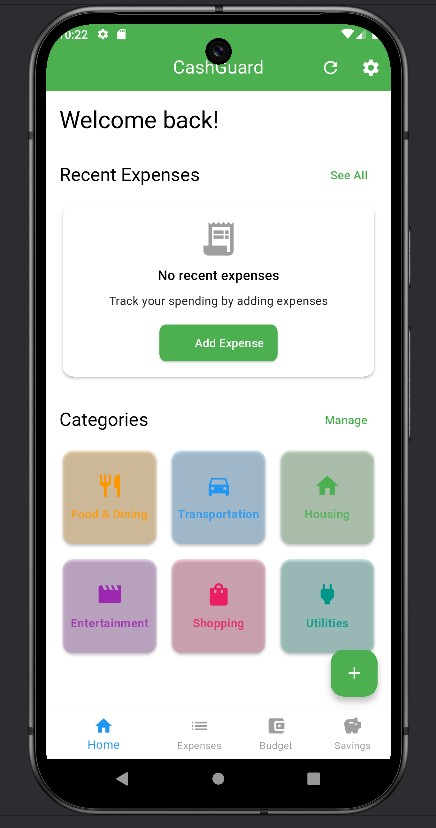

# Smart Expense & Budget Tracker for Students

## Overview
The **Smart Expense & Budget Tracker for Students** is a personal finance management application designed to help students track their daily expenses, manage budgets, and save money efficiently.

## Core Features

### 1. Expense Logging & Categorization
- **Manual Entry**: Users can manually enter their expenses.
- **Categories**: Expenses can be categorized under various headings.

### 2. Budget Setting & Alerts
- **Create Budget**: Users can define a total monthly budget.

### 3. Savings Goals & Reminders
- **Set Goals**: Users can set savings goals.

### 4. Simple Reports & Graphs
- **Visual Representation**: Provides visual reports.

## Conclusion
The **Smart Expense & Budget Tracker for Students** is an essential tool for students looking to manage their finances effectively.

---

Feel free to explore the app and take control of your finances today!
